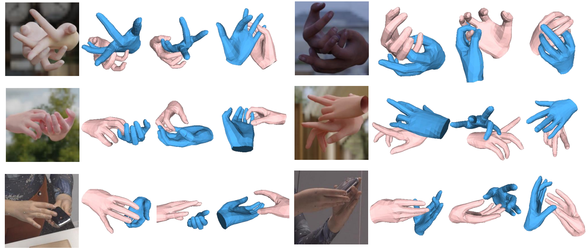

# OminiHands



## Creating Environment

```bash
conda create --name omhand python=3.10
conda activate omhand
```

```bash
pip install torch torchvision --index-url https://download.pytorch.org/whl/cu117
pip install -e .[all]
pip install -v -e third-party/ViTPose
```


## Download Checkpoints

We provide models and checkpoints that can deal with following tasks: Single Image Reconstruction, Video Reconstruction, Multiview Reconstruction.

Download our checkpoint [Demo_Video.pth](https://drive.google.com/file/d/1ZoP4qmYE8MyXCfhGK5meWWfBOYpy1VZ7/view?usp=sharing), [Demo_Image.pth](https://drive.google.com/file/d/1jLo7cFIWeDXep_hhvumWdm90QIwy_HwB/view?usp=sharing), [Demo_Multiview.pth](https://drive.google.com/file/d/10EZF6qLQuTyrxS0glP23HFOAdiLQ9gy7/view?usp=sharing), [Eval_Video.pth](https://drive.google.com/file/d/1SeX9t6mKpkQp3V3YqxTdQzDuXnnVNgZl/view?usp=sharing), and put them under **./checkpoints** . The Demo checkpoints are for in-the-wild demo, and the Eval checkpoint is for dataset validation on Interhand2.6m. 

And download mano files from [MANO](https://mano.is.tue.mpg.de/), put **MANO_RIGHT.pkl** and **MANO_LEFT.pkl** under **_DATA/data/mano**.

## Demo

### Video

Set **VIDEO_PATH** as your video file path

```
python run_demo.py \
    --checkpoint ./checkpoints/Demo_Video.pth \
    --cfg ./checkpoints/config_video.yaml \
    --video_dir VIDEO_PATH \
    --out_dir ./demo_out \
    --gpu 0 \
    --mode video
```


### Images

Put all images in **IMAGE_FOLDER** , run:

```
python run_demo.py \
    --checkpoint ./checkpoints/Demo_Image.pth \
    --cfg ./checkpoints/config_image.yaml \
    --image_dir IMAGE_FOLDER \
    --out_dir ./demo_out \
    --gpu 0 \
    --mode image
```


### Multiview

Put multi-view images in **IMAGE_FOLDER**, run the following code

```
python run_demo.py \
    --checkpoint ./checkpoints/Demo_Multiview.pth \
    --cfg ./checkpoints/config_multi.yaml \
    --image_dir IMAGE_FOLDER \
    --out_dir ./demo_out \
    --gpu 0 \
    --mode multi
```


## Acknowledge

[HaMeR](https://github.com/geopavlakos/hamer/tree/main)

[ViTPose](https://github.com/ViTAE-Transformer/ViTPose/tree/d5216452796c90c6bc29f5c5ec0bdba94366768a)

[IntagHand](https://github.com/Dw1010/IntagHand)

[Deformer](https://github.com/fuqichen1998/Deformer)